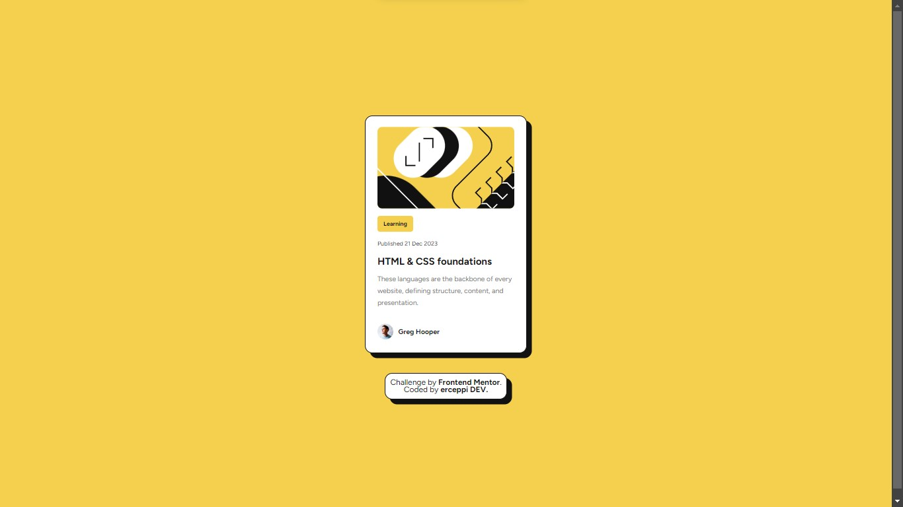

Basado en el código HTML y CSS que proporcionaste, así como el template del README, aquí tienes el README para tu proyecto:

---

# Frontend Mentor - Blog preview card solution

This is a solution to the [Blog preview card challenge on Frontend Mentor](https://www.frontendmentor.io/challenges/blog-preview-card-ckPaj01IcS). Frontend Mentor challenges help you improve your coding skills by building realistic projects.

## Table of contents

- [Overview](#overview)
  - [The challenge](#the-challenge)
  - [Screenshot](#screenshot)
  - [Links](#links)
- [My process](#my-process)
  - [Built with](#built-with)
  - [What I learned](#what-i-learned)
- [Author](#author)

## Overview

### The challenge

Create a business card; Minimalistic, modern and elegant.

### Screenshot




### Links

- Solution URL: [Add solution URL here](https://your-solution-url.com)
- Live Site URL: [Add live site URL here](https://your-live-site-url.com)

## My process

### Built with

- Semantic HTML5 markup
- CSS custom properties
- Flexbox
- Mobile-first workflow

### What I learned

During this project, I enhanced my skills in structuring semantic HTML and styling with CSS. Here's a snippet of the code I'm proud of:

```html
<article class="card__block">
  <h2 class="card__block--category">Learning</h2>
  <h2 class="card__block--date">Published 21 Dec 2023</h2>
  <h1 class="card__block--title">HTML & CSS foundations</h1>
  <p class="card__block--description">These languages are the backbone of every website, defining structure, content, and presentation.</p>
</article>
```

```css
.container {
  display: flex;
  flex-direction: column;
  gap: 2.4rem;
  background-color: hsl(0, 0%, 100%);
  max-width: 32.7rem;
  max-height: 48rem;
  padding: 2.4rem;
  border: solid;
  border-radius: 1.5rem;
  border-color: hsl(0, 0%, 7%);
  border-width: 0.1rem;
  box-shadow: 1rem 1rem hsl(0, 0%, 7%);
  margin: 0 auto;
}
```

## Author

- Website - [Add your name here](https://www.your-site.com)
- Frontend Mentor - [@erceppi](https://www.frontendmentor.io/profile/erceppi)
- GitHub - [erceppi](https://github.com/erceppi)

